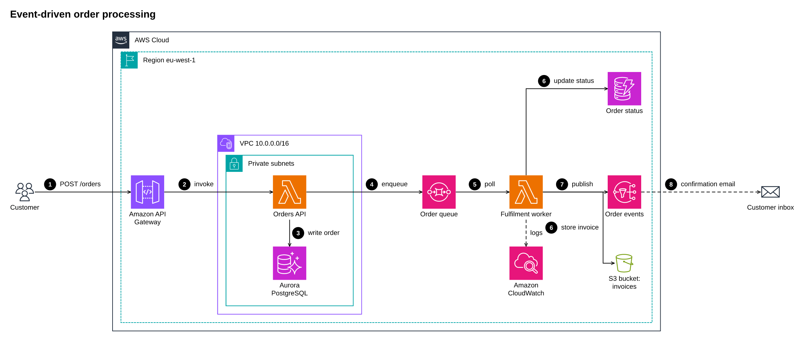
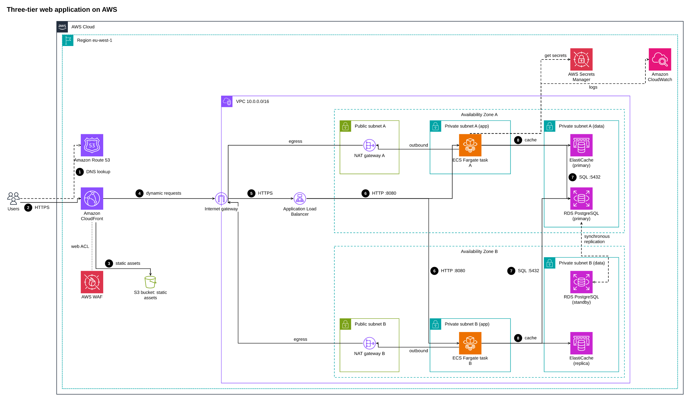
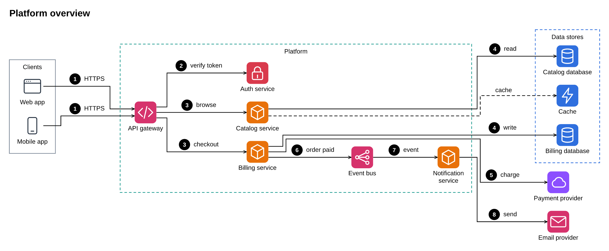
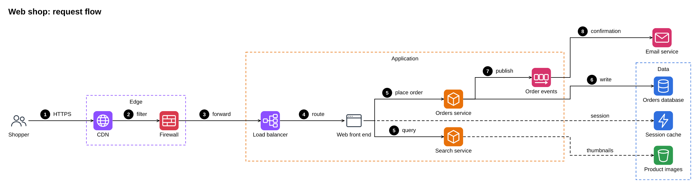
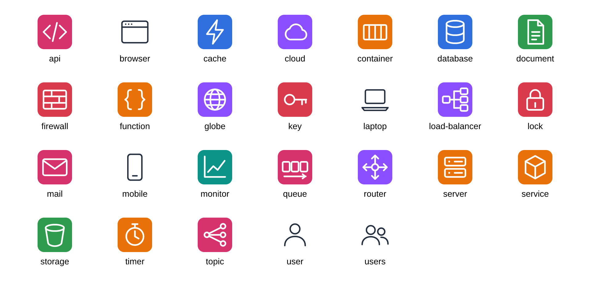

# diagram-skill

An agent skill that draws architecture diagrams. Describe the system; the agent writes a small JSON spec, runs one script and gets a clean PNG (and SVG) for your document. Offline, no browser, no Graphviz, nothing to install beyond Node.js.



- **Two profiles.** `aws`: AWS architecture style with the official AWS Architecture Icons (you import the pack once, see below). `generic`: any architecture, with 26 bundled icons.
- **No coordinates.** Layout (ELK), orthogonal line routing, group styles, numbered step badges and labels are automatic. Hints (`rank`, `back`, `border`) steer the few cases that need it.
- **Agent friendly.** `SKILL.md` teaches the loop: write the spec, `--check` (all problems at once, with "did you mean"), render, look at the picture, refine. Pictures take 0.5 to 1.5 s.
- **Zero install, deterministic.** The three runtime components are vendored and verified against SHA-256 sums. No network at install or run time; the same spec gives the same bytes on Windows and Linux (Node 18 and 24 tested).

## Install

With [APM](https://github.com/microsoft/apm) (Agent Package Manager):

```
apm install masteris777/diagram-skill#v0.1.0
```

APM copies the skill to `.claude/skills/diagram/` (Claude Code) and `.agents/skills/diagram/` (Copilot, Cursor, Gemini and others), whichever targets your project uses. Without APM, copy `.apm/skills/diagram/` to the folder your agent reads skills from, or run the script directly. You need Node.js 18 or newer; that is all.

While the repository is private, pm install uses the GitHub credentials already on the machine (it worked with gh auth login done).

```
node .claude/skills/diagram/scripts/diagram.mjs --doctor      # is this machine ready?
node .claude/skills/diagram/scripts/diagram.mjs spec.json out.png --svg --width 2400
```

## Use

Ask your agent for a diagram ("draw the three-tier architecture of our web shop as an AWS diagram, steps numbered") and it follows `SKILL.md`. Or write a spec yourself:

```json
{ "title": "Serverless API", "profile": "aws",
  "groups": [ { "id": "cloud", "label": "AWS Cloud", "type": "AWS Cloud" } ],
  "nodes": [
    { "id": "users", "label": "Users",              "icon": "Users" },
    { "id": "api",   "label": "Amazon API Gateway", "icon": "Amazon API Gateway", "group": "cloud" },
    { "id": "fn",    "label": "AWS Lambda",         "icon": "AWS Lambda",         "group": "cloud" } ],
  "edges": [
    { "from": "users", "to": "api", "label": "HTTPS request", "step": 1 },
    { "from": "api",   "to": "fn",  "label": "invoke",        "step": 2 } ] }
```

Reference: [SKILL.md](.apm/skills/diagram/SKILL.md), [spec](.apm/skills/diagram/references/spec.md), [layout recipes](.apm/skills/diagram/references/layout.md), [AWS style](.apm/skills/diagram/references/aws-style.md), [profiles](.apm/skills/diagram/references/profiles.md).

## The AWS icons (bring your own)

AWS lets customers and partners use its icons to create architecture diagrams but states no right to redistribute them, so they are not in this repository. One person downloads the "Icon package" zip from <https://aws.amazon.com/architecture/icons/> and imports it once per AWS release:

```
node .claude/skills/diagram/scripts/diagram.mjs --import-icons Icon-package_07312026.zip
```

The import builds a per-user icon store (`%LOCALAPPDATA%\diagram-skill`, `~/Library/Application Support/diagram-skill` or `~/.local/share/diagram-skill`; `DIAGRAM_SKILL_HOME` overrides) outside the skill, so skill updates never remove it. Teams can keep the zip in an internal store and point `DIAGRAM_SKILL_ICONS` at a shared store file. Without the pack, use `"profile": "generic"`.

## Examples

| | |
|---|---|
|  |  |
| [aws/medium.json](.apm/skills/diagram/examples/aws/medium.json): 3-tier app, mirrored AZs, 8 steps | [generic/platform.json](.apm/skills/diagram/examples/generic/platform.json): generic icons, coloured groups |
|  |  |
| [generic/web-app.json](.apm/skills/diagram/examples/generic/web-app.json) | the 26 bundled generic icons |

More: [aws/tiny](.apm/skills/diagram/examples/aws/tiny.json), [aws/large](.apm/skills/diagram/examples/aws/large.json) (four accounts and an on-premises data centre, 35 nodes), [aws/event-driven](.apm/skills/diagram/examples/aws/event-driven.json).

## How it works

spec (JSON) -> validation -> ELK layered layout on several seeds, a cost function picks the best -> own routing for stacked groups -> SVG with the icons as `<symbol>` -> PNG with resvg (WebAssembly) and a bundled Liberation Sans font. Everything provider specific (group styles, icon names, icon source) lives in a profile, so more providers are new folders under `profiles/`.

## Limits

- Not for sequence diagrams, charts, ER or UML class diagrams.
- Nested AWS pictures usually need 2 to 4 look-and-fix rounds; the agent has to look at the PNG. Beyond roughly 35 nodes, split into several pictures. `direction: DOWN` makes lines cross node labels; prefer `RIGHT`.
- Text is set in Liberation Sans: Latin, Greek and Cyrillic work; CJK and emoji do not.
- Tested on Windows 11 and Debian containers (Node 18 and 24, non-root, no network, no system fonts). Not tested: macOS, Windows on ARM, Alpine, behind a TLS-intercepting proxy, with security software that blocks WebAssembly.
- resvg-wasm is 2.6.2 (2024); rare SVG features are missing.

## Security and provenance

No network access at run time, no install scripts, no native binaries (WebAssembly is data). The script reads the spec and icon files you point it to and writes the PNG/SVG and the per-user icon store. `vendor/SHA256SUMS` lists every vendored file; `--doctor` and the tests verify it; `vendor/README.md` records versions, sources and npm integrity values. `apm audit` reports no hidden Unicode in the package.

## Development

```
node test/run.mjs                                   # tests, also what CI runs
node test/run.mjs --aws-pack <zip|folder>           # also the AWS examples with the real icon pack
node test/run.mjs --update [--aws-pack P]           # re-render the example pictures and golden hashes (look first)
node tools/make-generic-icons.mjs && node tools/icon-sheet.mjs
```

## Licence

MIT, see [LICENSE](LICENSE). Vendored components keep their licences (EPL-2.0, MPL-2.0, OFL-1.1): [NOTICE.md](NOTICE.md). Not affiliated with Amazon Web Services; AWS and the AWS Architecture Icons are Amazon's.
